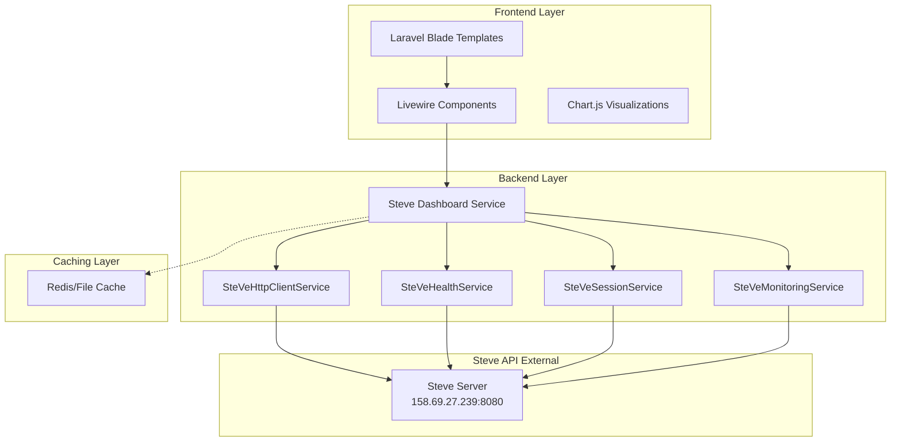
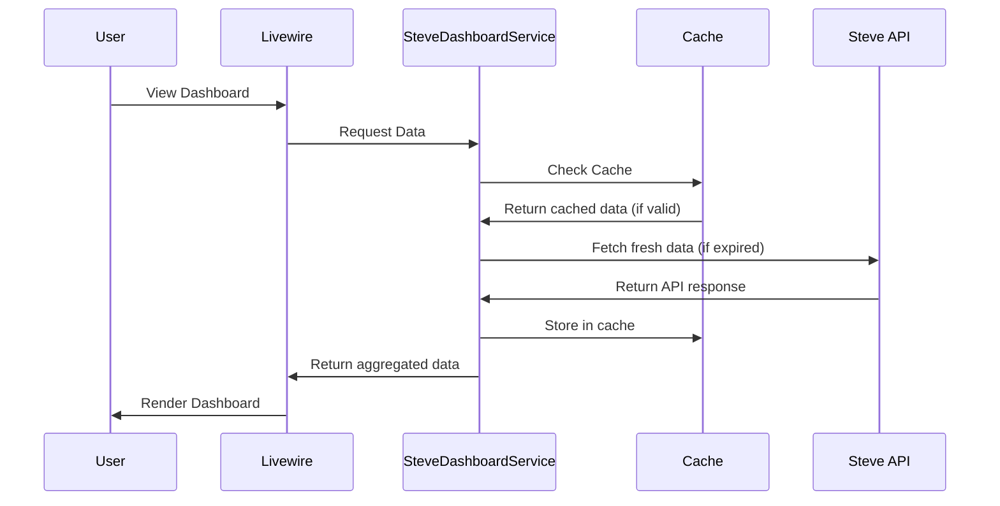

# Steve API Dashboard - Comprehensive Implementation Plan

## 1. Project Overview

### Objective
Build a comprehensive real-time dashboard for electric vehicle charging station management using the existing Steve API integration. The dashboard will display authentic data from the Steve API with proper caching, error handling, and responsive visualizations.

### Key Requirements
- Real-time data from Steve API (not simulated/mock data)
- 10 key metrics and visualizations
- Laravel backend with caching strategies
- Responsive frontend with Livewire components
- Clean RESTful API endpoints
- Proper error handling for API failures

---

## 2. Architecture Overview



---

## 3. Dashboard Metrics & Components

### 10 Key Metrics to Display

| # | Metric | Description | Data Source |
|---|--------|-------------|-------------|
| 1 | Charging Sessions | Session counts and details | SteVeSessionService |
| 2 | Active Sessions | Currently ongoing charges | ChargingSession Model + Steve API |
| 3 | Energy Distributed | Total kWh delivered | SteVeHttpClientService |
| 4 | Operational Stations | Station status breakdown | ChargingPoint Model |
| 5 | Charger Types | Type breakdown (Type 1, Type 2, CCS, etc.) | ChargingPoint Model |
| 6 | Per-Station Performance | Individual station metrics | SteVeSessionService |
| 7 | Station Availability | Available/Occupied/Fault status | ChargingPoint Model |
| 8 | Real-time Session Monitoring | Live session updates | WebSocket/Poll |
| 9 | Network Connectivity | API connection status | SteVeHealthService |
| 10 | Network Performance | Response times, uptime | SteVeMonitoringService |

---

## 4. Implementation Plan

### Phase 1: Backend Services

#### 4.1 Create SteveDashboardService
- **File**: `app/Services/SteveDashboardService.php`
- **Purpose**: Central service to aggregate all dashboard data
- **Methods**:
  - `getDashboardSummary()` - Overall stats
  - `getChargingSessions()` - Session history
  - `getActiveSessions()` - Currently active
  - `getEnergyMetrics()` - kWh distributed
  - `getStationStatus()` - Operational status
  - `getChargerTypes()` - Type breakdown
  - `getPerStationMetrics()` - Individual performance
  - `getAvailabilityStatus()` - Available vs occupied
  - `getNetworkHealth()` - Connectivity status
  - `getPerformanceAnalytics()` - Response times

#### 4.2 Create Caching Strategy
- **Cache Keys**:
  - `steve:dashboard:summary` - 60 seconds
  - `steve:dashboard:sessions` - 30 seconds
  - `steve:dashboard:active` - 10 seconds (real-time)
  - `steve:dashboard:energy` - 300 seconds
  - `steve:dashboard:stations` - 60 seconds
  - `steve:dashboard:health` - 30 seconds

### Phase 2: API Endpoints

#### 4.3 Create SteveDashboardController
- **File**: `app/Http/Controllers/SteveDashboardController.php`
- **Routes**:
  ```
  GET /api/steve/dashboard/summary
  GET /api/steve/dashboard/sessions
  GET /api/steve/dashboard/active-sessions
  GET /api/steve/dashboard/energy
  GET /api/steve/dashboard/stations
  GET /api/steve/dashboard/station/{id}
  GET /api/steve/dashboard/health
  GET /api/steve/dashboard/performance
  POST /api/steve/dashboard/refresh
  ```

#### 4.4 Create API Resource Classes
- `app/Http/Resources/Steve/DashboardSummaryResource.php`
- `app/Http/Resources/Steve/SessionResource.php`
- `app/Http/Resources/Steve/StationResource.php`
- `app/Http/Resources/Steve/HealthResource.php`

### Phase 3: Livewire Components

#### 4.5 Create Livewire Components
- **Dashboard Container**: `SteveDashboard.php`
- **Metric Cards**:
  - `Dashboard/StatsCard.php`
  - `Dashboard/ActiveSessionsCard.php`
  - `Dashboard/EnergyCard.php`
- **Charts**:
  - `Dashboard/SessionsChart.php`
  - `Dashboard/ChargerTypesChart.php`
  - `Dashboard/AvailabilityChart.php`
- **Real-time**:
  - `Dashboard/RealTimeMonitor.php`

### Phase 4: Frontend Views

#### 4.6 Create Dashboard View
- **File**: `resources/views/steve/dashboard/index.blade.php`
- **Layout**: Extends existing admin layout
- **Components**:
  - Header with refresh button
  - Stats grid (4 columns)
  - Charts row
  - Stations table
  - Real-time monitor panel

#### 4.7 Add Route
- **File**: `routes/web.php`
- ```php
  Route::middleware(['auth', 'verified'])
      ->get('/steve/dashboard', [SteveDashboardController::class, 'index'])
      ->name('steve.dashboard');
  ```

---

## 5. Data Flow

### Real-time Data Flow


---

## 6. Error Handling

### API Failure Strategy
1. **Timeout**: Show cached data with "Last updated" timestamp
2. **Connection Error**: Display offline banner with retry button
3. **Partial Failure**: Show available metrics, hide failed ones
4. **Authentication Error**: Log error, show configuration alert

### Error Response Format
```json
{
  "success": false,
  "error": "Connection timeout",
  "last_valid_data": {...},
  "retry_after": 30
}
```

---

## 7. File Structure

```
app/
├── Http/
│   ├── Controllers/
│   │   └── SteveDashboardController.php
│   ├── Livewire/
│   │   └── Steve/
│   │       ├── SteveDashboard.php
│   │       ├── StatsCard.php
│   │       ├── ActiveSessionsCard.php
│   │       ├── SessionsChart.php
│   │       └── RealTimeMonitor.php
│   └── Resources/
│       └── Steve/
│           ├── DashboardSummaryResource.php
│           ├── SessionResource.php
│           └── StationResource.php
├── Services/
│   └── SteveDashboardService.php
└── Models/
    └── (existing models)

resources/
└── views/
    └── steve/
        └── dashboard/
            └── index.blade.php

routes/
└── web.php (add route)
```

---

## 8. Implementation Order

### Step-by-step Checklist

- [ ] 1. Create SteveDashboardService
- [ ] 2. Add caching methods
- [ ] 3. Create SteveDashboardController
- [ ] 4. Add API routes
- [ ] 5. Create API Resources
- [ ] 6. Create main Livewire component
- [ ] 7. Create chart Livewire components
- [ ] 8. Create dashboard view
- [ ] 9. Add navigation link
- [ ] 10. Test and verify

---

## 9. Key Services to Leverage

| Service | Purpose | Key Methods |
|---------|---------|-------------|
| SteVeHttpClientService | Core API communication | `makeRequest()`, `get()` |
| SteVeHealthService | Health checks | `checkHealth()` |
| SteVeSessionService | Session data | `getSessions()`, `getActiveSessions()` |
| SteVeMonitoringService | Station monitoring | `getChargingPointsStatus()` |
| SteVeDataSyncService | Data synchronization | `syncChargingPoints()` |
| CacheService | Caching utilities | `remember()`, `forget()` |

---

## 10. Success Criteria

1. ✅ Dashboard displays real data from Steve API (no mocks)
2. ✅ All 10 metrics are visible and accurate
3. ✅ Page loads in under 3 seconds (with caching)
4. ✅ Graceful error handling for API failures
5. ✅ Responsive design works on mobile/tablet/desktop
6. ✅ Real-time updates every 10 seconds for active sessions
7. ✅ Proper French/English translations
8. ✅ Follows existing codebase conventions
